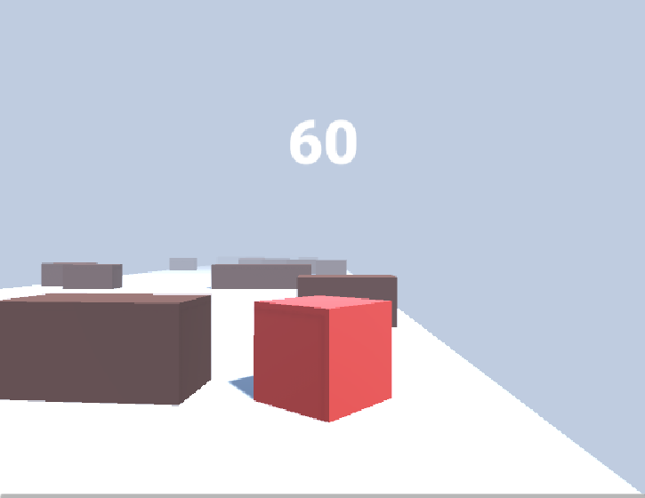

# Cubethon
Avoid the obstacles and get to the end!

Basically the goal of this game is getting to the end of each stage without touching the obstacles.

It's a game I'm developing while learning the <a href="https://en.wikipedia.org/wiki/Unity_(game_engine)"> Unity engine</a>. I took <a href="https://www.youtube.com/watch?v=IlKaB1etrik"> this tutorial</a> as a basis, but I added jumps, sound effects and several other features.

## Skills
- Learning Unity Engine
- 3D Environment
- Making Builds
- Making Setups
